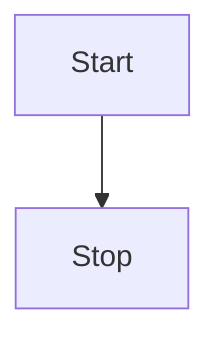

# 🧅 OnionJS

Type-safe way to declare, use and compose high-order functions library based on [Hotscript](https://github.com/gvergnaud/hotscript).

## Defining Layers

<!-- SCHEMA HERE -->

In `Onion.JS`, _**Layers**_ are functions that transform _**Subjects**_ from a `before` state to an `after` state.



For instance, you may want to `JSON.stringify` the `body` property of an object:

<!-- NOTE: We could simply use JSON.stringify as a layer once Return exists: https://github.com/gvergnaud/hotscript/issues/121 -->

```ts
import type { Objects } from 'hotscript'
import type { Layer } from 'onion.js'

const jsonStringifyBody: Layer<
  Record<string, unknown>, // subject type
  Objects.Update<'body', string>, // outward HOFn
  Objects.Update<'body', unknown> // inward HOFn
> = before => {
  const after = {
    ...before,
    body: JSON.stringify(before.body)
  }

  return after
}
```

Now, you can wrap any object with this layer like this:

<!-- EQUATION (A) HERE -->

```ts
import { Onion } from 'onion.js'

const before = {
  body: { foo: 'bar' }
}

const after = Onion.wrap(before).with(jsonStringifyBody)
//      ^? { body: string } 🙌
```

This example was with one layer, but we can combine as many as we want:

```ts
import type { Identity } from 'hotscript'
import type { Layer } from 'onion.js'

// Logs the subject
const logSubject: Layer<Record<string, unknown>, Identity, Identity> = before => {
  console.log(before)
  return before
}

// Layers are gracefully composed 🙌
const after = Onion.wrap(before).with(
  logSubject, // 1st layer
  jsonStringifyBody, // 2nd layer etc.
  ...
)
```

Layers can also work "inward": Given an after type and some layers, `Onion.js` can infer the `before` type:

```
AFTER INTERFACE - LAYERS (inward) => BEFORE INTERFACE
```

```ts
const after = Onion.produce<{ body: string }>()
  .with(
    jsonStringifyBody, // last layer
    log, // 2nd to last etc.
    ...
  )
  .from({ body: { foo: 'bar' } })
//   ^? ({ body: unknown }) => { body: string } 🙌
```

> [!TIP]
> This makes reading more natural. If, just follow your eyes from the before to the after, the layers will be applied in that order.

## High-Order Functions

**Functions** are a valid type of subjects, and that's where `OnionJS` starts to shine ✨

In this case, layers receive `before` functions and return `after` functions (hence the _"high-order function"_ name).

It's hard to get your head around at first, so let's take an example! Let's apply `jsonStringifyBody` to the **output** of a function:

```ts
import type { Functions, Objects } from 'hotscript'
import type { Layer, Onion } from 'onion.js'

const jsonStringifyRespBody: Layer<
  (...params: unknown[]) => Record<string, unknown>,
  Functions.MapReturnType<Objects.Update<'body', string>>,
  Functions.MapReturnType<Objects.Update<'body', unknown>>
> = before => {
  // `before` and `after` are functions now
  function after(...params: unknown[]) {
    return jsonStringifyBody(before(...params))
  }

  return after
}
```

Now we can do the same as above:

```ts
import { Onion } from 'onion.js'

const before = () => ({ body: { foo: 'bar' } })

const after = Onion.wrap(before).with(jsonStringifyRespBody)
//      ^? () => { body: string } 🙌

const produced = Onion.produce<() => { body: string }>()
  .with(jsonStringifyRespBody)
  .from(before)
//   ^? (before: () => { body: unknown }) => (() => { body: string }) 🙌
```

## Composing

That will gracefully `compose` helper to combine Layers both at run-time and type-wise to create a new layer:

```ts
import { compose } from 'onion.js'

// Layers are gracefully composed 🙌
const logAndStringify = compose(log, jsonStringifyBody)

const after = Onion.wrap({ body: { foo: 'bar' } }).with(logAndStringify)
//      ^? { body: string } 🙌
```

## Dynamic Layers

Sometimes, layer behaviors need to a specific context.

Nothing stops us from **dynamically generate layers**:

```ts
type JSONStringifyPropLayer<KEY extends string> = Layer<
  Record<string, unknown>,
  Objects.Update<KEY, string>,
  Objects.Update<KEY, unknown>
>

const jsonStringifyProp =
  <KEY extends string>(key: KEY): JSONStringifyPropLayer<KEY> =>
  before => {
    const after = {
      ...before,
      [key]: JSON.stringify(before[key])
    }

    return after
  }

const after = Onion.wrap({ yolo: { foo: 'bar' } })
  //    ^? { yolo: string } 🙌
  .with(jsonStringifyProp('yolo'))
```

We can even compose dynamically, just need to be a bit careful with types, and use the `ComposeLayers`:

```ts
import type { ComposeLayers } from 'onion.js'

type LogAndStringifyPropLayer<KEY extends string> = ComposeLayers<
  LogLayer,
  JSONStringifyPropLayer<KEY>
>

const logAndStringifyProp = <KEY extends string>(
  key: KEY
): JSONStringifyPropLayer<KEY> => compose(log, jsonStringifyProp(key))

const after = Onion.wrap({ yolo: { foo: 'bar' } })
  //    ^? { yolo: string } 🙌
  .with(jsonStringifyProp('yolo'))
```

## What else?

**Lightweight** Only 3KB
