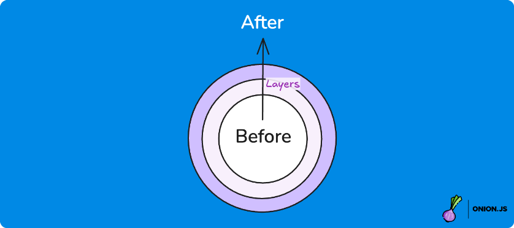
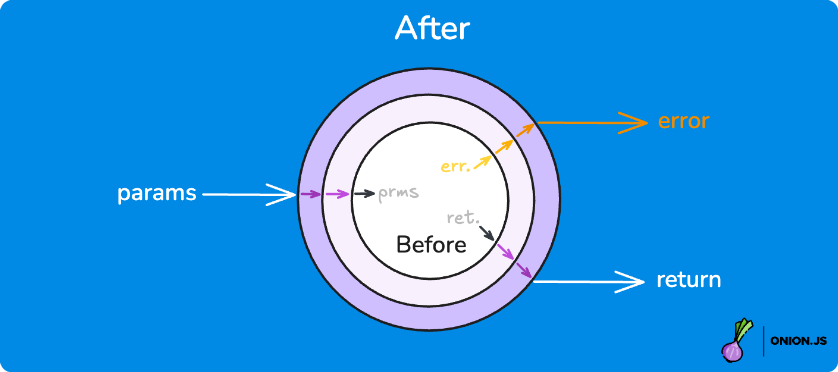

💖 _Huge thanks to the [sponsors](https://github.com/sponsors/ThomasAribart) who help me maintain this repo:_

<p align="center">
  <a href="https://www.theodo.fr/"></a></td>&nbsp;&nbsp;
  <!-- sponsors --><!-- sponsors -->
  <a href="https://github.com/sponsors/ThomasAribart"></a>
</p>

# 🧅 Wrap everything, without breaking types 🥲

`OnionJS` is a **type-safe** and **ultra-lightweight** _(2KB)_ library to design and apply **wrappers**, based on [HotScript](https://github.com/gvergnaud/hotscript) **high-order types**.

In particular, it's awesome for building and using type-safe [**middlewares**](https://en.wikipedia.org/wiki/Middleware) (see the [dedicated section](#-building-middlewares)).

## Table of content

- 🎬 [Installation](#-installation)
- 🌈 [Layers](#-layers)
- 🧅 <a href="#-onionwrap"><code>Onion.wrap</code></a>
- ♻️ <a href="#️-onionproducetype"><code>Onion.produce</code></a>
- 🚀 [Building Middlewares](#-building-middlewares)
- 🏗️ [Composing Layers](#%EF%B8%8F-composing-layers)
- 💪 [Customizable Layers](#-customizable-layers)

## 🎬 Installation

```bash
# npm
npm install @onion.js/core

# yarn
yarn add @onion.js/core
```

## 🌈 Layers

In `OnionJS`, _**Layers**_ are functions that transform _**Subjects**_ from a `before` to an `after` state:



For instance, let's define a layer that `JSON.stringifies` the `'body'` property of an object:

<!-- NOTE: We could simply use JSON.stringify as a layer once Return exists: https://github.com/gvergnaud/hotscript/issues/121 -->

```ts
import type { Layer } from '@onion.js/core'
import type { Objects } from 'hotscript'

const jsonStringifyBody: Layer<
  Record<string, unknown>, // subject type
  Objects.Update<'body', string>, // outward HO Type
  Objects.Update<'body', unknown> // inward HO Type
> = before => {
  const after = {
    ...before,
    body: JSON.stringify(before.body)
  }

  return after
}
```

## 🧅 `Onion.wrap`

We can now apply this layer to any object with `Onion.wrap`:

```ts
import { Onion } from '@onion.js/core'

const before = {
  headers: null,
  body: { foo: 'bar' }
}

const after = Onion.wrap(before).with(jsonStringifyBody)
//      ^? { headers: null; body: string } 🙌
```

Notice how the `after` type is correctly inferred thanks to [Hotscript](https://github.com/gvergnaud/hotscript) high-order types!

...And why stop here? Let's add **more layers**:

```ts
import type { Identity } from 'hotscript'

// Logs the object
const logObject: Layer<
  Record<string, unknown>,
  Identity,
  Identity
> = before => {
  console.log(before)
  return before
}

// Layers are gracefully composed 🙌
const after = Onion.wrap(before).with(
  logObject, // 1st layer
  jsonStringifyBody, // 2nd layer etc.
  ...
)
```

## ♻️ `Onion.produce<TYPE>`

But wait, that's not all! Layers can also work _**inward**_ 🤯

Given an `after` type and some layers, `OnionJS` can infer the expected `before` type:


For instance, we can reuse `jsonStringifyBody` to produce the same result as above with `Onion.produce`:

```ts
const after = Onion.produce<{ headers: null; body: string }>()
  .with(
    jsonStringifyBody, // last layer
    logObject, // 2nd to last etc.
    ...
  )
  .from({ headers: null, body: { foo: 'bar' } })
//   ^? ({ headers: null; body: unknown }) => { headers: null; body: string } 🙌
```

> ☝️ Note that layers are applied in reverse for improved readability.

## 🚀 Building Middlewares

`OnionJS` really shines when **wrapping functions** with [middlewares](https://en.wikipedia.org/wiki/Middleware).

In this case, layers receive `before` functions and return `after` functions (hence the _"high-order function"_ name):



For instance, let's apply `jsonStringifyBody` to the **output** of a function:

```ts
import type { Layer } from '@onion.js/core'
import type { Functions, Objects } from 'hotscript'

const jsonStringifyRespBody: Layer<
  (...params: unknown[]) => Record<string, unknown>,
  Functions.MapReturnType<Objects.Update<'body', string>>,
  Functions.MapReturnType<Objects.Update<'body', unknown>>
> = before => {
  function after(...params: unknown[]) {
    return jsonStringifyBody(before(...params))
  }

  return after
}
```

Now we can use this layer to `wrap` and `produce` functions 🙌 With literally the same code as above:

```ts
import { Onion } from '@onion.js/core'

const before = () => ({ body: { foo: 'bar' } })

const after = Onion.wrap(before).with(jsonStringifyRespBody)
//      ^? () => { body: string } 🙌

const produced = Onion.produce<() => { body: string }>()
  .with(jsonStringifyRespBody)
  .from(before)
//   ^? (before: () => { body: unknown }) => (() => { body: string }) 🙌
```

## 🏗️ Composing Layers

You can create new layers from existing ones with `compose`:

```ts
import { compose, Onion } from '@onion.js/core'

const composedLayer = compose(logObject, jsonStringifyBody, ...)
const after = Onion.wrap(before).with(composedLayer)

// Similar to:
const after = Onion.wrap(before).with(
  logObject,
  jsonStringifyBody,
  ...
)
```

## 💪 Customizable Layers

Layers can **accept parameters** to allow for customization. But make sure to use [generics](https://www.typescriptlang.org/docs/handbook/2/generics.html) if needed!

For instance, let's define a `jsonStringifyProp` layer that `JSON.stringifies` any property you want:

```ts
type JSONStringifyPropLayer<KEY extends string> = Layer<
  Record<string, unknown>,
  Objects.Update<KEY, string>,
  Objects.Update<KEY, unknown>
>

const jsonStringifyProp =
  <KEY extends string>(key: KEY): JSONStringifyPropLayer<KEY> =>
  before => {
    const after = {
      ...before,
      [key]: JSON.stringify(before[key])
    }

    return after
  }

const after = Onion.wrap({ yolo: { foo: 'bar' } })
  //    ^? { yolo: string } 🙌
  .with(jsonStringifyProp('yolo'))
```

We can even compose customizable layers by making good use of the `ComposeLayers` type:

```ts
import type { ComposeLayers } from '@onion.js/core'

type LogAndStringifyPropLayer<KEY extends string> = ComposeLayers<
  LogObjectLayer,
  JSONStringifyPropLayer<KEY>
>

const logAndStringifyProp = <KEY extends string>(
  key: KEY
): JSONStringifyPropLayer<KEY> => compose(logOject, jsonStringifyProp(key))

const after = Onion.wrap({ yolo: { foo: 'bar' } })
  //    ^? { yolo: string } 🙌
  .with(jsonStringifyProp('yolo'))
```
